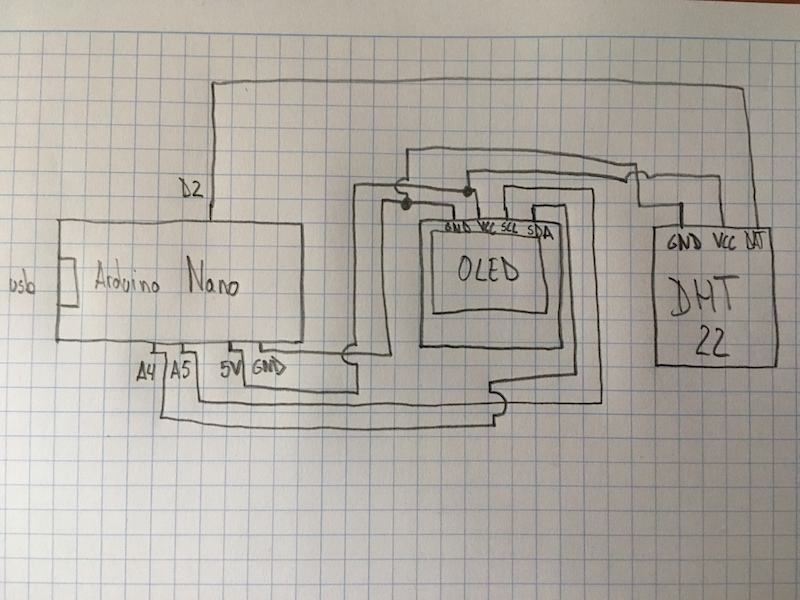

# TempDisplayNano:
Temperature and humidity display.

## Component list:
* Arduino Nano
* Oled SSD1306 I2C
* DHT22

## Libraries used:
* [Adafruit SSD1306 Oled display library](https://github.com/adafruit/Adafruit_SSD1306)
* [Adafruit GFX library](https://github.com/adafruit/Adafruit-GFX-Library)
* [DHT library](https://github.com/adafruit/DHT-sensor-library)

## Arduino Nano pinout: [PDF](http://www.pighixxx.com/test/pinouts/boards/nano.pdf) 

## [Program](tempdisplaynano.ino)

## Schematics:

